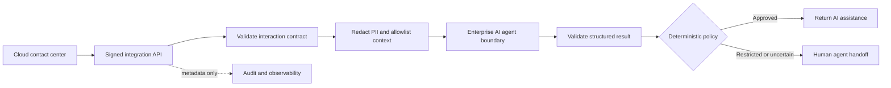
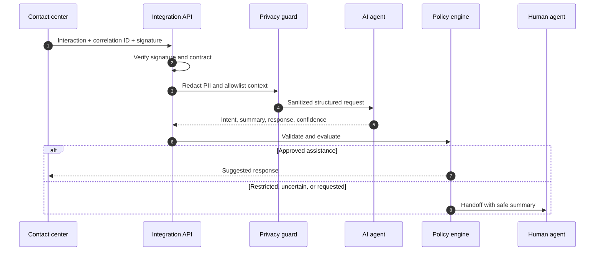

# AI Contact Center Integration Starter

[](https://github.com/3QInnova/ai-contact-center-integration-starter/actions/workflows/ci.yml)

An original, vendor-neutral Node.js reference implementation for connecting a
cloud contact center to an enterprise AI agent while preserving privacy,
deterministic policy, auditability, and human escalation.

The service accepts real-time interaction context through a signed API,
validates the contract, redacts common PII, forwards only explicitly allowlisted
context to a replaceable AI provider, validates the provider response, and uses
code-based policy to decide whether AI assistance may continue or a human agent
must take over.

## What this demonstrates

- AWS Lambda and API Gateway using the Node.js 22 runtime;
- HMAC webhook verification with constant-time comparison;
- strict interaction and provider response contracts;
- correlation IDs across contact-center and AI boundaries;
- email, phone, and payment-card redaction;
- explicit customer-context allowlisting;
- replaceable AI-provider boundary with deterministic local behavior;
- human escalation for restricted actions, low confidence, or customer request;
- metadata-only structured audit events;
- environment configuration without committed credentials;
- eleven automated tests and GitHub Actions continuous integration.

## Architecture



### Interaction lifecycle



## Safe provider boundary

The default deterministic provider requires no model credentials. It exists to
exercise the integration, privacy, and escalation controls locally.

A production adapter can call an approved enterprise AI gateway, private model,
or managed agent platform. The adapter should receive only the sanitized
contract and must return:

```json
{
  "intent": "general_support",
  "summary": "Customer requested general assistance.",
  "response": "I can help with that.",
  "confidence": 0.91,
  "requestedAction": "respond"
}
```

AI output is treated as untrusted input. The model recommends; deterministic
code decides.

## Run locally

Requires Node.js 22 or later.

```bash
npm install
npm test
```

Invoke the handler directly:

```bash
node --input-type=module -e '
import { handler } from "./src/handler.js";
const request = {
  rawPath: "/v1/interactions/assist",
  requestContext: { http: { method: "POST" } },
  headers: { "x-correlation-id": "demo-001" },
  body: JSON.stringify({
    interactionId: "interaction-001",
    channel: "voice",
    utterance: "I need help understanding my statement.",
    context: { customerSegment: "preferred", authenticated: true }
  })
};
console.log(await handler(request));
'
```

## Deploy

For demonstration use:

```bash
export SIGNING_SECRET="read-this-from-a-secret-manager"
npx serverless deploy --stage dev --region us-east-1
```

Before production deployment, replace the example CORS origin, use authenticated
API Gateway routes, retrieve secrets from AWS Secrets Manager, and implement the
controls in [SECURITY.md](SECURITY.md).

## Original public demonstration

This repository contains original demonstration code created for public use by
3QInnova LLC. It does not contain employer, client, vendor-exported, or
proprietary source code.

## License

MIT © 2026 3QInnova LLC

